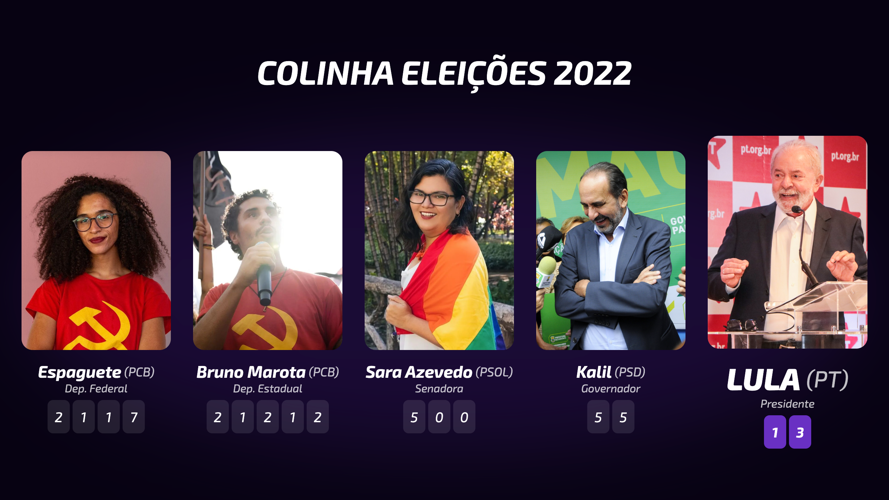

# Colinha Eleições 🗳
O voto é secreto. 🤫

## Personalizar
1. Clone esse repositório
2. Instale as dependências com `yarn`
3. Abra o servidor de desenvolvimento com `yarn dev`
4. Altere seus candidatos em **[App.svelte](./src/App.svelte)**
5. Altere as fotos em **[/public/img](./public/img)** no formato `[número].webp`

## Compartilhar
1. Acesse http://localhost:5173 no seu navegador
2. Abra o devtools, ative o device mode, coloque a resolução `1280x720`
3. Clique nos três pontinhos e clique para capturar screenshot

_Para gerar a imagem em formato de story, acesse http://localhost:5173?story=1 e repita o processo usando a resolução `1080x1920`._
